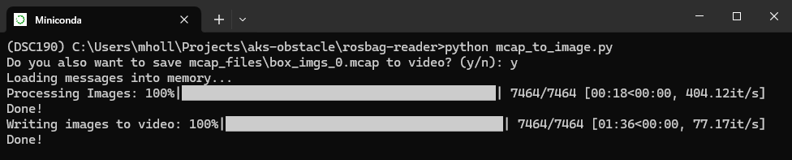

# ROS Bag to Images/Video



This utility converts ROS bag (.mcap) files into a series of images or a single video file.

## Quickstart

1. **Add Your MCAP File:**  
   Place a singular `.mcap` file into the `mcap_file` folder.

2. **Configure Topic (Optional):**  
   The default image topic is `/oak/rgb/image_raw`. If you wish to use a different topic, update the `TOPIC_NAME` variable in the Python script.

3. **Clear Output Directory:**  
   Ensure the `output` folder is empty to avoid mixing new images with old ones.

4. **Run the Script:**  
   Execute the script from your command line:
   ```bash
   python mcap_to_image.py
   ```

## Requirements

Before running the script, you'll need to install the necessary Python dependencies. Make sure you have Python installed on your system and then run the following command in this directory.

```bash
pip install -r requirements.txt
```